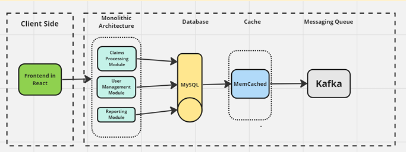

# Claims Processing System

## 📌 Introduction

The **Claims Processing System** is a centralized platform developed for a U.S.-based insurance organization to efficiently manage and process insurance claims.

It integrates data from multiple sources and provides real-time claim tracking, automated evaluation, and detailed reporting.

---

## 🏗️ Project Architecture

The system follows a **monolithic architecture**, where all components are part of a single deployable unit.

---

### 🖥️ Client Side
- Frontend built using **React**
- Communicates with backend via REST APIs

---

### ⚙️ Monolithic Backend

All functionalities are tightly integrated into one application:

#### 🔹 Claims Processing Module
- Handles claim validation, processing, and updates

#### 🔹 User Management Module
- Manages authentication and role-based access

#### 🔹 Reporting Module
- Generates claim reports and analytics

---

### 🗄️ Database
- Uses **MySQL**
- Centralized database for all modules

---

### ⚡ Cache Mechanism
- Uses **Memcached**
- Stores frequently accessed data like:
  - Claim status
  - Policy details
  - User sessions

---

### 📩 Messaging System
- Uses **Apache Kafka**
- Enables:
  - Real-time notifications
  - Asynchronous processing

---

### 🔐 Security
- Implements **OAuth 2.0** for secure authentication and authorization

---

### 📜 Logging & Monitoring
- **Log4j2** for logging  
- Integrated with **Splunk** for monitoring and analytics  

---

### 🚀 Deployment & Operations

#### 🐳 Containerization
- Docker for packaging the application

#### ☸️ Orchestration
- Kubernetes for managing containers

#### 🔄 CI/CD
- Jenkins for automated pipelines

#### 🧑‍💻 Version Control
- GitLab for collaboration

---
